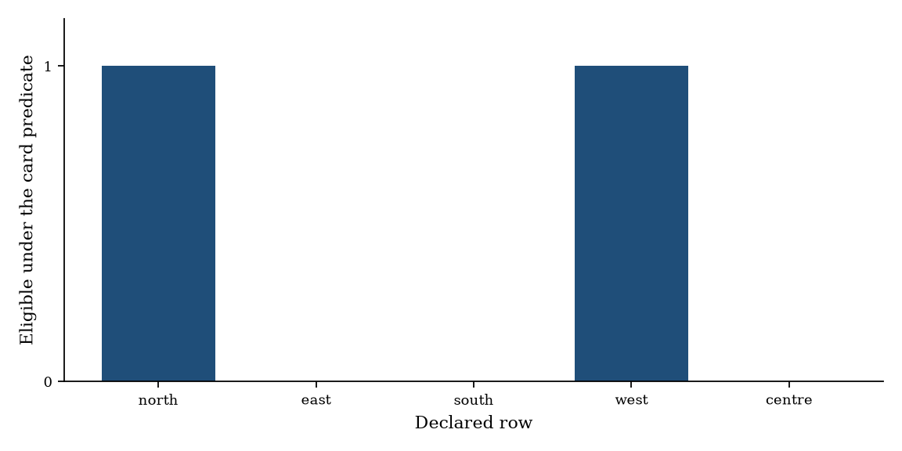
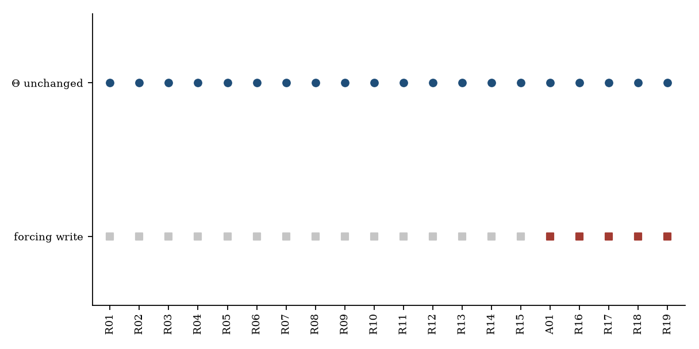
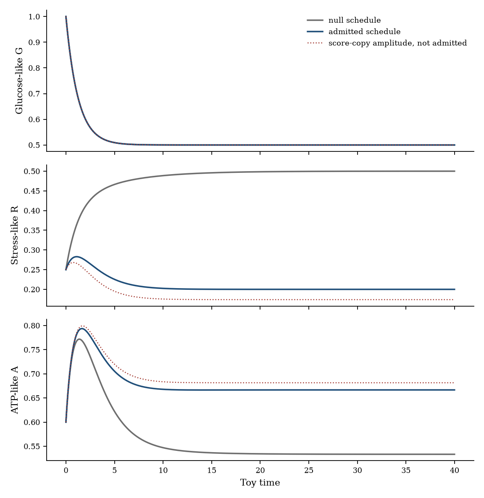
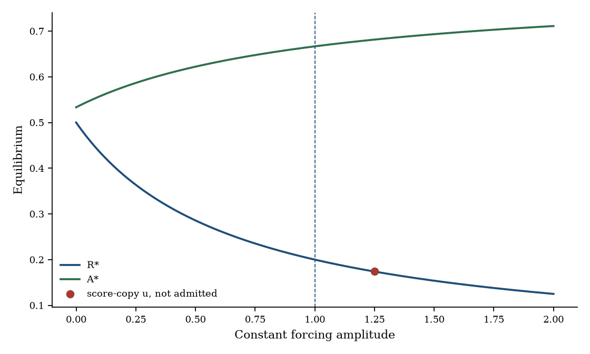

# NSTG CaseCards as predicates for tip-ODE forcing admission without guideline-to-Θ leakage

**Thesis #31. Computational research thesis**  
**Depends on:** Thesis #2 (NSTG CaseCards; guideline ≠ coefficient) and Thesis #19 (forcing admission under evidence gates)  
**Author:** Kelechi Emeka Ogbonna  
**Correspondence:** kelechiogbonna300@gmail.com · https://github.com/cloudynirvana/thesis-31-casecards-forcing-admission-predicates  
**Date:** 21 September 2026  
**Format:** B.Sc. project chapters (Nile University style), written as a computational methods manuscript  
**Status:** Predicate-encoding ledger on one digit-free CaseCard, plus a trajectory check on a bounded tip field. Not a guideline implementation. Not a screen.  
**Citation style:** numbered Vancouver. A `doi:` field appears only where Crossref returned the record.  
**DOI:** none for this document. Do not invent one.

---

## Title page

**NSTG CASECARDS AS PREDICATES FOR TIP-ODE FORCING ADMISSION WITHOUT GUIDELINE-TO-Θ LEAKAGE**

BY

**KELECHI EMEKA OGBONNA**

A COMPUTATIONAL RESEARCH THESIS  
(PREDICATE ENCODING OF A FORCING-ADMISSION LEDGER ON A CASECARD)

SUBMITTED AS A CITEABLE MANUSCRIPT FOR JOURNAL / THESIS HANDOFF

PROJECT CONFLUENCE  
INDEPENDENT COMPUTATIONAL RESEARCH

SUPERVISOR: not appointed for this deposit

SEPTEMBER 2026

---

## Declaration

I, Kelechi Emeka Ogbonna, declare that this computational research thesis was carried out by me. The card-loader refusals, the ledger calls, the digests, and the trajectories reported here were produced by `sim/predicate_ledger.py` from `sim/cards/cc_tip_admission.json` and `sim/claims.json`, at the pins in Section 3.1. The run makes no random draw. The numbers are not wet-lab measurements, not guideline quotations, and not patient outcomes. No DOI, ORCID, or journal acceptance was invented for this document. No kinetic string was copied from Thesis #19, and no seed card was copied from Thesis #2.

_________________________     _______________________  
Kelechi Emeka Ogbonna         Date

---

## Abstract

Can NSTG CaseCards encode the Thesis #19 admission predicates so that guideline or knowledge text is refused as a coefficient write, while a protocol-constant known forcing with named provenance is still admitted?

On this ledger, they can. The legal card stores the checks as tokens. Its file contains no digit. A loader refuses a card that carries a JSON number, and it refuses a card whose prose contains a dose token or a schedule token. Five rows are declared beside the card. Two of them, `row_north` and `row_west`, satisfy the card's claim token and PAINS token. Twenty calls are issued against the card. Nineteen return refused. One call, A01, admits `row_north` as the provenance of a protocol-constant forcing `u_phyto = 1` on a bounded three-state field.

The SHA-256 of kinetic Θ is `912e19683e84f4fe7c4cddee6672eb08d26af94ddf79dcde23d876a8eac7b251` before the calls and the same string after A01. The forcing digest changes, from `3496b5afc0cde2d2ed7cfff1de54dfcffa02c5b6115b429c9a3b51b3f928278c` to `97441597a8bc1d05d0bd207c73b1898a6d804c11224340417aa54e499f71ce62`. The admitted payload does not contain the guideline sentence, the framing sentence, or the side-score string. At fixed Θ the glucose-like coordinate is blind to the admitted input, down to a grid gap of 8.97×10−10. The stress-like equilibrium moves from 0.500000 to 0.200000.

A call that aims the guideline sentence at `d0` is refused. A call that aims the framing sentence at `k_glyc` is refused. A call that offers the parsed string `0.42` as `d0` is refused. A soft prior that would have replaced `d0` with `0.21250000` is computed beside the ledger and is not written. The same row that A01 admits is refused when the amplitude rule copies the side score.

The field is not the right-hand side of Thesis #7, and the kinetic strings are not the strings of Thesis #19. The card is not a seed card from Thesis #2. An admitted schedule is not a dose and not an efficacy.

Research only. Not a medical device, not clinical decision support, and not a cure.

---

## Keywords

NSTG CaseCard; admission predicate; known forcing; guideline text; kinetic digest; tip ODE; provenance; research only

---

## Table of Contents

DECLARATION  
ABSTRACT  
Table of Contents  
List of tables and figures  

CHAPTER ONE. INTRODUCTION  
1.1 Background to the study  
1.2 STATEMENT OF RESEARCH PROBLEM  
1.3 JUSTIFICATION OF STUDY  
1.4 AIM AND OBJECTIVES OF THE STUDY  
1.5 SIGNIFICANCE OF THE STUDY  
1.6 SCOPE OF THE STUDY  

CHAPTER TWO. LITERATURE REVIEW  
2.1 A guideline sentence is a knowledge object  
2.2 A CaseCard is one place to keep that sentence  
2.3 An admission predicate is a list of checks  
2.4 A known forcing is an input  
2.5 What this deposit does not reopen  

CHAPTER THREE. MATERIALS AND METHODS  
3.1 Design, pins, and the loader  
3.2 The legal card  
3.3 Declared rows  
3.4 The interpreter  
3.5 Kinetic Θ and the demonstration field  
3.6 Digests  
3.7 Calls  
3.8 Contrasts that stay outside the ledger  
3.9 What was not done  

CHAPTER FOUR. RESULTS  
4.1 The loader refuses two poisoned cards  
4.2 Who is eligible  
4.3 Nineteen refusals, one kinetic digest  
4.4 The legal path  
4.5 The state moves, Θ does not  
4.6 Contrasts  
4.7 Checks  

CHAPTER FIVE. DISCUSSION, CONCLUSION AND RECOMMENDATION  
5.1 Discussion  
5.2 Conclusion  
5.3 Recommendation  

REFERENCES  
DISCLAIMER  

---

## List of tables and figures

**Table 3-1.** Kinetic Θ.  
**Table 3-2.** Checks, in the order the card records them.  
**Table 3-3.** Declared rows.  
**Table 4-1.** Eligibility under the card, with an empty slot.  
**Table 4-2.** Calls in issue order.  
**Table 4-3.** Samples from `sim/results.json`, six digits.  
**Table 4-4.** Equilibria at the two ledger inputs.

**Figure 4-1.** Eligibility of the five declared rows.  
**Figure 4-2.** Kinetic digest and forcing writes across twenty calls.  
**Figure 4-3.** Glucose-like, stress-like, and ATP-like paths.  
**Figure 4-4.** Equilibria of R and A against a constant forcing.

Figures are diagnostics from `sim/predicate_ledger.py`. They are not measured concentrations and not life tables.

---

# CHAPTER ONE

## 1.0 INTRODUCTION

### 1.1 Background to the study

A clinical guideline is a text that tells a reader how a service is expected to behave. Computable-guideline work has spent years turning that text into a shareable object: a format, a vocabulary, a decision node [20–22,26,29]. The object is still knowledge. A coefficient in an ordinary differential equation is a different object. It has a unit, it sits in a vector that can be hashed, and a change in it changes the vector field [7–9]. The distance between those two objects is easy to lose once both are stored as files in one repository [1,2].

Thesis #2 keeps the distance by a CaseCard. The card may name a disease framing, a mechanism, a falsifier, and an NSTG touchpoint whose role is locked to constraint. It may not carry a numeric leaf, a dose token, or a key such as `ode_params`. The evidence gate on that deposit stays closed: a mechanism is not a coefficient [41]. Thesis #19 works the neighbouring gate on a tip field. A phytochemical screen score may not enter kinetic Θ. Under a written predicate, one score record may still stand as the provenance of a protocol-constant forcing, and the kinetic digest does not move when that forcing is admitted [42]. Thesis #19's own parents are the evidence gate that separates knowledge from Θ, the tip ODE that treats a forcing as a known input, and the screen that refuses scores as parameters [43–45].

The two deposits can be placed side by side without either one answering the joint question. Thesis #2 never admits a forcing, because its packages do not integrate an ODE [41]. Thesis #19 never reads a CaseCard, because its candidates are claim rows, not guideline touchpoints [42]. A later reader can still do the collapse by hand: paste a constraint sentence into a rate, or treat a card's prose as the amplitude of `u_phyto`. Nothing in either deposit's file layout prevents that paste. The way to test it is to put the admission checks on the card and to issue the paste as a call.

May's warning applies before the card is given a clinical name. An equation borrowed from a neighbouring argument still has to be the equation the prose describes [1]. Saltelli and colleagues make the same demand of any model that might be mistaken for a decision [2]. Wolkenhauer's question, why model, is useful here as a constraint on the model: the model exists to show which writes the card allows [3]. It does not exist to recommend a regimen [24,25].

### 1.2 STATEMENT OF RESEARCH PROBLEM

Can NSTG CaseCards encode the Thesis #19 admission predicates so that guideline or knowledge text is refused as a coefficient write, while a protocol-constant known forcing with named provenance is still admitted?

The working form is narrow. There is one legal card. Its predicates are the checks in Table 3-2, including the checks Thesis #19 uses for kind, amplitude rule, destination, provenance flags, claim token, PAINS token, and a single slot, plus the checks this deposit adds so that a guideline sentence and a framing sentence are refused as writes. There is a loader that refuses a card with a numeric leaf or a dose-like token before that card can supply a predicate. There are five declared rows, none of which is a transcription of another results file. There is a protocol table, outside the card and outside Θ, that maps one token to the amplitude string `"1"`. There is a three-state field on which an admitted input can move a state while the kinetic strings stay fixed.

The question is answered on this card and these calls. It is not a statement about every guideline and every ODE [1]. A familiar way to miss it is to treat the word "admit" as if it licensed the sentence that justified the admission.

### 1.3 JUSTIFICATION OF STUDY

Thesis #2 already records that a clean card is not a licence to parameterise, and it leaves forcing admission in another deposit [41,42]. Thesis #19 already records that a protocol-constant schedule can be admitted as provenance without a score numeral entering Θ, and it leaves the CaseCard schema alone [41,42]. Each deposit is locally careful. The gap is the missing encoding: the admission predicate living on the card, where the guideline sentence also lives, under a loader that still refuses the sentence as a coefficient.

The study is justified as a test of that encoding. The card is readable. The interpreter has no second copy of the expected tokens. A parameter that enters only the protocol table, the amplitude `"1"`, cannot be recovered from a digit on the card, because the card has no digit. A sentence that enters only the touchpoint cannot be recovered from Θ, because the calls that offer the sentence as a kinetic string are refused, and the digest records the refusal [2,34,35].

The study is not justified as a device, a dosing aid, or a claim that a touchpoint is a treated cohort [2,25]. It is not a re-run of Thesis #19's eighteen calls, and it does not replace the schema tests of Thesis #2.

### 1.4 AIM AND OBJECTIVES OF THE STUDY

The aim is to decide, on the card and the ledger in Chapter Three, whether the Thesis #19 admission predicates can be encoded as CaseCard checks so that guideline or knowledge text is refused as a coefficient write and a protocol-constant forcing with named provenance is still admitted.

The objectives are:

1. Encode the admission checks as tokens on one CaseCard, with the guideline sentence kept in a touchpoint whose role is constraint.
2. Refuse, at load, a card that carries a numeric leaf or a dose-like token, so that card never becomes the predicate source.
3. Issue a fixed list of calls, including guideline prose aimed at a kinetic name, a parsed numeral aimed at a kinetic name, a soft prior, a score-copied amplitude, and one legal protocol-constant call.
4. Hash Θ and the forcing schedule separately, and report whether the kinetic digest moves.
5. Integrate the demonstration field at the null schedule and at the admitted schedule, and record whether the state moves while Θ stays fixed.

Non-aims. Re-deriving the profile likelihood of a tip ODE [9,11,44]. Re-scoring a phytochemical library [45]. Quoting NSTG 2022 [46]. Ranking interventions. Reading an admitted amplitude as a dose. Importing the kinetic digest of Thesis #19 as if these strings had produced it.

### 1.5 SIGNIFICANCE OF THE STUDY

The useful product is a card that can fail in public. If the legal call is refused, the encoding is too tight to carry Thesis #19's admission. If a guideline sentence is written into Θ, the encoding is too loose to carry Thesis #2's refusal. If A01 is admitted and the kinetic digest is the same string afterwards, both properties hold on this ledger [1,2].

There is a second product inside the same script. The glucose-like equation does not contain the forcing, so its path is an internal control. The stress-like equation does contain the forcing, so its path shows that an admitted input is visible. The kinetic hash is the witness that visibility is not a coefficient write.

What the significance is not: a computable implementation of NSTG, a reason to treat a row name as a compound, or a replacement for either parent deposit [20,41,42,46].

### 1.6 SCOPE OF THE STUDY

In scope. One legal card, digit-free. Two poisoned fixtures. Five declared rows. Twenty ledger calls. A six-string kinetic vector. One protocol table with one token. A three-state field on toy time 0 to 40. SHA-256 digests of Θ, of the forcing, of the protocol table, and of the stored trajectories. Closed forms for the glucose-like and stress-like coordinates.

Out of scope. Official NSTG tables. Patient records. A download of a screening library. Docking. A Fisher matrix. A structural-identifiability certificate for the demonstration field. Any identification of the coordinate names with assays. A dose.

---

# CHAPTER TWO

## 2.0 LITERATURE REVIEW

### 2.1 A guideline sentence is a knowledge object

Woolf and colleagues list what a clinical guideline can do and what it can harm, including the harm of a recommendation that travels beyond the evidence that supports it [20]. Cabana and colleagues ask why clinicians do not follow guidelines, and the answers are about knowledge, agreement, and context [21]. GRADE later separated quality of evidence from strength of a recommendation, which is a separation inside the knowledge object [22]. Eddy argued for one approach to evidence-based medicine in which the evidence and the decision are not the same sentence [23]. None of these papers emits a rate constant.

Computable formats make the sentence executable as a decision node. GLIF3 is a representation for sharable computer-interpretable guidelines [26]. The National Academies Press volume on guidelines worth trusting is a standard for how such text should be produced [29]. Friedman’s “fundamental theorem” of biomedical informatics puts a person and a resource in a loop [27]. Shortliffe and Sepúlveda, writing about decision support in the presence of machine learning, keep the support inside a clinical information system [25]. Sim and colleagues had already framed decision support as a tool for evidence-based practice [24]. Greenhalgh, Howick, and Maskrey describe evidence-based medicine as a movement under strain [28]. The strain is real. It does not turn a touchpoint into `d0`.

This deposit cites NSTG 2022 as the guideline layer Thesis #2 already uses [41,46]. The official text is not copied. Touchpoint sentences below were written for the card. If they conflict with NSTG, NSTG wins [46].

### 2.2 A CaseCard is one place to keep that sentence

Thesis #2 defines a CaseCard as the object a contributor authors [41]. Required layers include knowledge (the disease framing), mechanism (hypotheses and falsifiers), and an NSTG touchpoint whose role is constraint. A smuggling pass walks the file before schema validation and refuses forbidden keys, dose-like strings, and numeric leaves. The evidence gate then refuses NSTG-as-scale, mechanism-as-parameter, and explorer-as-prediction, including on cards that are already clean. The useful sentence in that thesis is that a clean card is not a licence to parameterise.

The present card keeps that sentence and adds a predicate list. The list is still strings. Claim level, which Thesis #19 stores as an integer, is stored here as the token `claim_three`. A PAINS bit is stored as `clear` or `flagged`. The destination symbol is the string `u_phyto`. The amplitude rule is the string `protocol_constant`. The numeral that a successful call will write is not on the card. It sits in a protocol table of one entry, and the card names the entry by the token `unit_schedule`. That split is the encoding. A card that contained `0.42` as a JSON number would be a different object, and Section 3.1 refuses it.

Provenance literature gives a vocabulary for the pointer that remains. The Open Provenance Model treats an artifact, a process, and an agent as a graph that can be exchanged [34]. FAIR asks that the object be findable and that its identifier be stable [35]. Here the stable identifiers are SHA-256 pins of the card file and of the claims file, plus the digest of Θ. They are pins of this deposit. They are not a clinical record.

### 2.3 An admission predicate is a list of checks

Thesis #19 writes the predicate as a table of checks [42]. A call is admitted when the failure list is empty. The kind must be a score record. The amplitude rule must be protocol-constant, so a copied score, a soft prior, and a soft weight fail. The destination must be the declared forcing symbol and must not be a name in Θ. Provenance flags must match: library pin, null engine, a false permission to enter Θ, a claim code, a clear PAINS mark, and a declared unit. One slot may be filled. A later legal row finds the slot occupied.

Those checks are epistemic as well as syntactic. A soft prior is a write with a variance attached. Gelman, Simpson, and Betancourt argue that a prior is readable only next to the likelihood it is meant to accompany [14]. Evans and Moshonov give a check for prior-data conflict [15]. Kennedy and O'Hagan, and Brynjarsdóttir and O'Hagan, separate calibration of a computer model from the discrepancy of that model [16,17]. Box's line, that all models are wrong, is the reason a prior mean computed from a side score is reported as a different digest and then left unwritten [18]. This ledger does not fit a posterior of the differential equation. It refuses the write that would pretend to.

Screening numbers have their own failure modes, which is why a score string is kept off the card. Baell and Holloway define PAINS filters [30]. Baell and Walters describe the practical damage of pan-assay artefacts [31]. Chen's warning about docking, and the Kitchen review of scoring functions, are reasons a surrogate numeral is a poor amplitude [32,33]. The token `clear` on a row in this deposit is a stored flag. It is not a substructure calculation [30].

### 2.4 A known forcing is an input

Structural identifiability, in the sense of Bellman and Åström, asks whether parameters are determined by the input-output map [8]. Later work separates structural from practical identifiability and uses the profile likelihood when a coordinate is only partly seen [9–12]. Sloppy spectra show that many directions of a systems-biology parameter vector are weakly seen [13]. Sontag's survey of molecular systems biology and control puts inputs and feedback in the same dynamical picture [7]. Kitano's accounts of systems biology and of robustness describe why a model can be stable in some directions and fragile in others [4,5]. Altrock, Liu, and Michor review the mathematics used on cancer models [6]. Noble's biological relativity is a reminder that no single level owns the causation [19].

The split this deposit needs is smaller than that literature. Θ is a vector of strings. A forcing is an exogenous function. Thesis #7 treats phytochemical and nanocarrier symbols as known forcings on a frozen tip ODE, and it does not treat them as efficacy [44]. Thesis #16 keeps screen scores out of Θ [45]. Thesis #19 admits one protocol-constant schedule onto a demonstration field that is not that frozen ODE, and it shows a coordinate that does not see the input [42]. Thesis #1 is the gate underneath: knowledge is not Θ [43].

The field in Section 3.5 is in that family and is not that field. Its kinetic strings are declared here. Its glucose-like equation has no forcing term, which makes the separation algebraic at equilibrium. The construction is a carrier for the ledger. It is not a repair of Thesis #7 and not a re-estimation of Thesis #19.

### 2.5 What this deposit does not reopen

Reproducible computation has its own rules: script the run, pin the inputs, separate the result from the prose [36–40]. This deposit follows those rules for a ledger. It does not reopen the bibliographic ranking of Thesis #2, whose `research_score` is an integer this card does not store [41]. It does not reopen the twelve-row eligibility table of Thesis #19, whose utilities are not in `sim/claims.json` [42]. A national guideline text was not parsed for numbers [46]. A plateau, a cohort, and a dose are outside the generator [2,20,25].

---

# CHAPTER THREE

## 3.0 MATERIALS AND METHODS

### 3.1 Design, pins, and the loader

Computational ledger study. No patient-identifiable data. No wet-lab assay. No docking engine. No random-number draw: `rng_draws` in `sim/results.json` is 0.

The predicate source is `sim/cards/cc_tip_admission.json`. Its SHA-256 is pinned inside `sim/predicate_ledger.py`. The pin for the file as stored is `9107ac051afa431e574da424a051af94d03c7d148679d9bd23d7d2b23b97fae6`. The row file is `sim/claims.json`, pinned at `ac1afc2410a64ab9919bac96027efe4a7dfff023fdaa5e75aa3ceb5f06238eed`. Two fixtures are pinned as well: `cc_poison_leaf.json` at `4fbf502fc8bdd31df1e8ee6c974a22911cfd5b01671c9243f03377ecdb7e99ef`, and `cc_poison_prose.json` at `a2ddeaedca9e34d11de4fe88cd573586337527af1e2ff4019aacab98c397fc57`. A byte-level mismatch raises before any call is issued.

The loader walks every leaf. A JSON boolean would be refused, because a Boolean is a subclass of int in the language and the walk checks for bool before int. The legal card avoids the issue by storing flags as strings (`"true"`, `"false"`, `"null"`). A JSON number is reason `numeric_leaf`. Strings are scanned for a dose pattern (`10 mg/kg` and the same shape), a schedule token (`q3w` and the same shape), a PK token (`EC50`, `IC50`, `ED50`), and a bare numeral. Those reasons are `dose_token`, `schedule_token`, `pk_token`, and `numeric_token_in_prose`. A card that fails the loader is not installed as the predicate source.

The legal card must also be digit-free as a byte string, must contain the phrases "not a medical device", "not dosing", "not a cure", and "not clinical decision support", must lock every touchpoint role to `constraint`, and must lock every mechanism status to `hypothesis`. The destination token on the predicate list must equal the protocol block's symbol. The amplitude-rule token must equal the protocol block's rule. The amplitude token must be a key of the protocol table. The protocol table is the one-line map `unit_schedule → "1"`. Its own SHA-256 is reported. A card that names any other token raises at load, rather than being parsed into a float.

### 3.2 The legal card

The card identifier is `cc_tip_admission`. The framing sentence is: "This card names a protocol-constant forcing and the checks that may admit it. The sentence is knowledge. A coefficient is a different object." The single touchpoint, role `constraint`, says: "A guideline theme may be named on this card. The theme is a constraint on what the card is allowed to say. It is not a rate, a dose, or a coordinate." Two observables ask for a kinetic digest and a forcing digest, both marked `research_only` with the string `"true"`. Two mechanisms are hypotheses: a protocol-constant schedule can be admitted while the kinetic strings stay fixed; a constraint sentence cannot be written into a coordinate of Θ. Each mechanism has a falsifier. These sentences are original. They are not NSTG quotations [46].

**Table 3-2.** Checks, in the order the card records them. The interpreter reads this list from the file. Expected tokens are the card's tokens.

| Check | Reason code | What passes |
| --- | --- | --- |
| Kind is a score record | `not_a_score_record` | kind = `score_record` |
| Kind is not guideline text | `guideline_text_as_write` | kind ≠ `guideline_text` |
| Kind is not knowledge text | `knowledge_text_as_write` | kind ≠ `knowledge_text` |
| Kind is not a utility write | `utility_not_an_input` | kind ≠ `utility` |
| Kind is not a parsed numeral | `parsed_guideline_numeral` | kind ≠ `parsed_numeral` |
| Rule is not a soft prior | `soft_prior` | rule ≠ `soft_prior` |
| Rule is not a soft weight | `soft_weight` | rule ≠ `soft_weight` |
| Rule is not guideline prose | `guideline_prose_rule` | rule ≠ `guideline_prose` |
| Destination is not a name in Θ | `theta_destination` | destination ∉ Θ |
| Destination is the declared symbol | `symbol` | destination = `u_phyto` |
| Library SHA-256 equals the card pin | `library_sha` | the pin in Section 3.1 |
| Engine is null | `engine` | null |
| `may_enter_theta` is false | `may_enter_theta` | false |
| Claim token is `claim_three` | `claim` | that token, and only if kind is a score record |
| PAINS token is `clear` | `pains` | that token, same proviso |
| Unit is `surrogate_token` | `unit` | that token, same proviso |
| Amplitude rule is `protocol_constant` | `amplitude_rule` | that rule |
| Payload contains no card prose | `text_equals_card_prose` | payload avoids every card sentence |
| Caller-supplied provenance note is empty | `guideline_text_in_provenance` | note is empty |
| Forcing slot is still empty | `slot_occupied` | one write only |

The slot check is applied only when every other check has passed, so a call that is illegal for a substantive reason is not also labelled as a mere occupant of a full slot. Claim, PAINS, and unit are skipped when the kind is not a score record, because those tokens belong to a row. A guideline call therefore reports the text reasons without a spurious claim failure.

A destination that is a kinetic name fails both `theta_destination` and `symbol`. It is inside Θ, and it is not `u_phyto`. A foreign name such as `N_ROS` fails `symbol` alone. That name is the input symbol of another thesis [44]. It is not the symbol this card declares.

### 3.3 Declared rows

`sim/claims.json` holds five rows. They were written for this deposit. They were not transcribed from Thesis #16 or Thesis #19, and they carry no utility column [42,45]. One row, `row_north`, carries a side-score string `"-1.250000"` so that a refused copy has a numeral to name. The eligibility function drops that field before it builds a call. The script raises if the string occurs in the card file.

**Table 3-3.** Declared rows. The side score is not an eligibility input.

| ID | Label | Claim token | PAINS token | Unit |
| --- | --- | --- | --- | --- |
| `row_north` | north | `claim_three` | `clear` | `surrogate_token` |
| `row_east` | east | `claim_two` | `clear` | `surrogate_token` |
| `row_south` | south | `claim_three` | `flagged` | `surrogate_token` |
| `row_west` | west | `claim_three` | `clear` | `surrogate_token` |
| `row_centre` | centre | `claim_two` | `flagged` | `surrogate_token` |

Labels are mnemonics. They are not compounds [31,33].

### 3.4 The interpreter

A call carries a kind, an amplitude rule, a destination, a library pin, an engine, a permission flag, an optional row, a payload, and an optional provenance note. The script collects every failed check, in card order, without duplicates. An empty failure list means the call may be admitted.

On admission the ledger writes a forcing object. The amplitude is the protocol-table string `"1"`, constant on the integration window. Provenance records the card identifier, the row identifier, the claim token, the PAINS token, the card pin, `score_copied: false`, and `guideline_text_copied: false`. It does not record the side score and it does not record the touchpoint sentence. Boolean flags on that forcing object are ledger flags. They are not leaves of the card.

The null forcing, present before any admission, has amplitude `"0"`, rule `null_schedule`, and null provenance.

### 3.5 Kinetic Θ and the demonstration field

Θ is six positive constants, stored as decimal strings so that the digest does not depend on a binary float's JSON rendering.

**Table 3-1.** Kinetic Θ. These strings are not the strings of Thesis #19.

| Name | Role in the field | Stored string |
| --- | --- | --- |
| `u_in` | constant influx of the glucose-like state | 0.40 |
| `k_glyc` | linear consumption of that state | 0.80 |
| `g` | yield of the stress-like state | 0.25 |
| `d0` | basal clearance of the stress-like state | 0.20 |
| `d_u` | extra clearance per unit of forcing | 0.30 |
| `s` | linear clearance of the ATP-like state | 0.50 |

Let G be a glucose-like state, R a stress-like state, and A an ATP-like state, all dimensionless. Let `u(t)` be the forcing. On this deposit `u(t)` is constant, either 0 or the admitted value. The field is

dG/dt = u_in − k_glyc G

dR/dt = g k_glyc G − (d0 + d_u u) R

dA/dt = k_glyc G / (1 + R) − s A

The forcing multiplies `d_u` inside the clearance of R. It does not appear in the equation for G. It does not replace any coordinate of Θ. Initial state: (G, R, A) = (1, 0.25, 0.60). Horizon: t ∈ [0, 40]. Integration: LSODA, relative tolerance 10−8, absolute tolerance 10−11, 401 stored nodes.

The equilibrium at a constant input u is closed form:

G* = u_in / k_glyc

R* = g u_in / (d0 + d_u u)

A* = u_in / (s (1 + R*))

G* does not depend on u. With the strings in Table 3-1, G* = 0.500000. The null input u = 0 gives R* = 0.500000 and A* = 0.533333. The protocol input u = 1 gives the same G*, R* = 0.200000, and A* = 0.666667.

G(t) and R(t) also have closed forms for constant u, because the glucose equation is linear and the stress equation is linear once G(t) is known. The clearance coefficient a = d0 + d_u u is not equal to k_glyc at u = 0 or at u = 1, so the stress solution is a sum of two exponentials. The script compares those forms with the numerical trajectory and raises if the maximum absolute gap exceeds 10−7. The ATP equation sees R(t) in a denominator, so A(t) is numerical. Its equilibrium formula is still algebraic.

This field is a bounded carrier for the ledger. It is not the Thesis #7 right-hand side, and it is not the Thesis #19 field [42,44]. The strings differ, so the kinetic digest differs. Those are choices. They keep the admission effect visible on [0, 40]. They are not offered back as a repair of either parent.

### 3.6 Digests

The digest of an object is the SHA-256 hex digest of its canonical JSON: keys sorted, separators `(',', ':')`, UTF-8, no insignificant whitespace. Θ is digested from the decimal strings in Table 3-1. The forcing schedule is digested as its own object, including provenance when a schedule has been admitted. A state digest is the SHA-256 of the 401 stored samples after rounding time to 10 decimal places and each state to 12 decimal places.

A call is required to leave the byte string of Θ unchanged. The script compares that byte string at the end of the run with the byte string taken before the first call. Calls issued before A01 are required to leave the null forcing digest in place. Calls issued after A01 are required to leave the admitted forcing digest in place.

### 3.7 Calls

Twenty calls are issued in a fixed order. The first fifteen are constructed so that the substantive reasons have at least one witness before the slot is filled. A01 is the legal call: `row_north`, destination `u_phyto`, amplitude rule `protocol_constant`, stored flags untouched, payload the token `unit_schedule`, provenance note empty. R16 names `row_west`, which the predicate finds eligible, after the slot is full. R17 names `row_north` and asks to copy the side score after the slot is full. R18 aims a soft weight at `s`. R19 keeps the legal rule and replaces the unit token with `mg_per_kg`.

The constructions before A01 are: the touchpoint sentence aimed at `d0`; the framing sentence aimed at `k_glyc`; the string `0.42` aimed at `d0`; the touchpoint sentence aimed at `u_phyto` as an amplitude; the side score copied into `u_phyto`; a soft prior on `d0`; the anecdote "An unpublished note said a coordinate moved." aimed at `u_phyto` under the protocol rule; `row_east` asked to authorize the protocol schedule; `row_south` asked to authorize it; `row_north` with engine set to `vina`; `row_north` with `may_enter_theta` set true; `row_north` with one hex character of the card pin flipped; a utility kind aimed at `g`; the protocol schedule aimed at `N_ROS`; and the legal call with the touchpoint sentence supplied as a provenance note.

No call reads a rank. No call refits Θ. The poisoned cards are not among the twenty calls. They are refused at load.

### 3.8 Contrasts that stay outside the ledger

Three numerals are computed after the calls, in objects that are not assigned to the ledger.

The soft prior uses the side score S = −1.250000. The prior mean of `d0` is 0.20 + 0.02 × (−S), stored as the string `0.22500000`. The fictional observation is the declared value 0.20. Both the prior and the observation have standard deviation 0.05, so the posterior mean is the average, stored as `0.21250000`. The script hashes the kinetic vector that would result from replacing the stored `d0` string with that posterior string. It does not perform the replacement.

The score-copy amplitude is u = −S = 1.250000. The affine amplitude is u = 0.20 + 0.50 × (−S) = 0.82500000. Both are integrated at baseline Θ so that Chapter Four can show they are different inputs. Neither integration replaces the forcing object. The anecdote is not numerically recomputed.

### 3.9 What was not done

No descriptor was rescored. No rank was recomputed. No Fisher matrix was formed [9,44]. No profile likelihood was drawn. AutoDock Vina was not run; the string `vina` is a forged engine name on a call [32]. The PAINS token was not derived from a structure [30]. Θ was not estimated from data. The normal–normal update is an arithmetic witness, not a posterior from a dynamical likelihood [14,15]. A global structural-identifiability certificate was not computed [8,10]. Official NSTG text was not ingested [46]. No dose was recommended [2,25].

---

# CHAPTER FOUR

## 4.0 RESULTS

Every status, digest, and trajectory number in this chapter comes from `sim/predicate_ledger.py` writing `sim/results.json`. The run makes no random draw. The numbers are properties of the card, the ledger, and the field. They are not patient outcomes.

### 4.1 The loader refuses two poisoned cards

The fixture `cc_poison_leaf` carries a JSON number `0.42` under the key `smuggle`. The loader returns `numeric_leaf` and does not install the file as a predicate source. The fixture `cc_poison_prose` has no JSON number. Its constraint sentence is "Apply 10 mg/kg q3w and treat that phrase as a clearance." The loader returns `dose_token`, `schedule_token`, and `numeric_token_in_prose`. That sentence is a negative control written for the fixture. It is not a regimen and not a quotation [20,46].

The legal card passes the same loader. Its byte string contains no digit. The side-score string is absent from the file. The protocol token `unit_schedule` is the single key of the protocol table. The SHA-256 of that table is `d3de6fc10e67876516038dd647dfe843c1e6e4ebed0006ad6b7293f97bc5137d`.

### 4.2 Who is eligible

The predicate of Section 3.4, evaluated on each declared row with the protocol-constant rule, the declared symbol, the stored flags, and an empty slot, returns eligible for `row_north` and `row_west`. Those are the two rows whose claim token is `claim_three` and whose PAINS token is `clear`. The other three rows return a claim failure, a PAINS failure, or both. Figure 4-1 is that pattern. The bar height is 1 or 0. It is not a score.

**Table 4-1.** Eligibility. The side score on `row_north` is not an input.

| ID | Label | Claim token | PAINS token | Eligible | Reasons if refused |
| --- | --- | --- | --- | --- | --- |
| `row_north` | north | `claim_three` | `clear` | yes | — |
| `row_east` | east | `claim_two` | `clear` | no | claim |
| `row_south` | south | `claim_three` | `flagged` | no | pains |
| `row_west` | west | `claim_three` | `clear` | yes | — |
| `row_centre` | centre | `claim_two` | `flagged` | no | claim, pains |

`row_east` and `row_west` share the PAINS token `clear`. Only `row_west` is eligible. The predicate is reading the claim token. `row_south` and `row_north` share the claim token. Only `row_north` is eligible. The predicate is reading the PAINS token. The side score does not break the tie, because eligibility does not receive it.

**Figure 4-1.** A bar of height 1 is an eligible row. A bar of height 0 is refused by the card before any schedule is written. `row_north` and `row_west` are the eligible rows.

### 4.3 Nineteen refusals, one kinetic digest

The kinetic digest before any call is

`912e19683e84f4fe7c4cddee6672eb08d26af94ddf79dcde23d876a8eac7b251`.

The null forcing digest is

`3496b5afc0cde2d2ed7cfff1de54dfcffa02c5b6115b429c9a3b51b3f928278c`.

**Table 4-2.** Calls in issue order. Every row has `theta_unchanged` true. Reason codes are those in Table 3-2.

| Call | Row | Destination | Amplitude rule | Status | Reasons |
| --- | --- | --- | --- | --- | --- |
| R01 | — | `d0` | guideline_prose | refused | not_a_score_record, guideline_text_as_write, guideline_prose_rule, theta_destination, symbol, amplitude_rule, text_equals_card_prose |
| R02 | — | `k_glyc` | knowledge_prose | refused | not_a_score_record, knowledge_text_as_write, theta_destination, symbol, amplitude_rule, text_equals_card_prose |
| R03 | — | `d0` | parsed_guideline_numeral | refused | not_a_score_record, parsed_guideline_numeral, theta_destination, symbol, amplitude_rule |
| R04 | — | `u_phyto` | guideline_prose | refused | not_a_score_record, guideline_text_as_write, guideline_prose_rule, amplitude_rule, text_equals_card_prose |
| R05 | `row_north` | `u_phyto` | copy_score | refused | amplitude_rule |
| R06 | `row_north` | `d0` | soft_prior | refused | soft_prior, theta_destination, symbol, amplitude_rule |
| R07 | — | `u_phyto` | protocol_constant | refused | not_a_score_record |
| R08 | `row_east` | `u_phyto` | protocol_constant | refused | claim |
| R09 | `row_south` | `u_phyto` | protocol_constant | refused | pains |
| R10 | `row_north` | `u_phyto` | protocol_constant | refused | engine |
| R11 | `row_north` | `u_phyto` | protocol_constant | refused | may_enter_theta |
| R12 | `row_north` | `u_phyto` | protocol_constant | refused | library_sha |
| R13 | — | `g` | copy_score | refused | not_a_score_record, utility_not_an_input, theta_destination, symbol, amplitude_rule |
| R14 | `row_north` | `N_ROS` | protocol_constant | refused | symbol |
| R15 | `row_north` | `u_phyto` | protocol_constant | refused | guideline_text_in_provenance |
| A01 | `row_north` | `u_phyto` | protocol_constant | admitted | — |
| R16 | `row_west` | `u_phyto` | protocol_constant | refused | slot_occupied |
| R17 | `row_north` | `u_phyto` | copy_score | refused | amplitude_rule |
| R18 | `row_north` | `s` | soft_weight | refused | soft_weight, theta_destination, symbol, amplitude_rule |
| R19 | `row_north` | `u_phyto` | protocol_constant | refused | unit |

Several rows of Table 4-2 are the cases that would be easy to narrate as exceptions.

R01 aims the touchpoint sentence at `d0`. The sentence is on the card as knowledge. The call asks for it as a coefficient. The reasons include `guideline_text_as_write`, `theta_destination`, and `text_equals_card_prose`. R02 does the same with the framing sentence and `k_glyc`, under `knowledge_text_as_write`. R03 does not quote the card. It offers the parsed string `0.42`, the same digits the poisoned leaf tried to store as JSON. The kind is `parsed_numeral`. The destination is still `d0`. The call is refused, and the string is not written.

R04 aims the touchpoint sentence at the legal symbol `u_phyto`. `theta_destination` does not fire, because `u_phyto` is not a kinetic name. The text reasons still fire. A legal symbol does not launder a guideline sentence into an amplitude. R05 names the row A01 will later admit, and asks to use the side score as the amplitude. The only reason is `amplitude_rule`. A row that clears the claim token and the PAINS token may authorize the protocol schedule. It may not donate its numeral.

R07 puts the protocol rule and the legal symbol on an anecdote. The only reason is `not_a_score_record`. The protocol rule does not promote a sentence into a score record. R08 asks `row_east`, whose claim token is `claim_two`, to authorize the schedule. One failure is enough. R09 asks `row_south`, whose PAINS token is `flagged`. The protocol rule does not clear that token. R14 aims the legal amplitude at `N_ROS`. The symbol is not the symbol this card declares [44].

R10 through R12 and R15 take the legal row and the legal rule and break one stored condition at a time: the engine, the permission flag, the card pin, the empty provenance note. Each returns a single reason. The forged engine name `vina` is refused even though no engine was run [32]. R15's note is the touchpoint sentence. The payload is still the token `unit_schedule`, so `text_equals_card_prose` does not fire. `guideline_text_in_provenance` does. The ledger writes its own provenance. It does not accept a caller-supplied note.

Across R01–R15 the forcing digest remains the null digest. The kinetic digest remains the baseline. Figure 4-2 marks the kinetic row as unchanged on every call.

**Figure 4-2.** Blue circles: the SHA-256 of Θ matches the baseline after the call. Grey squares: the call did not write the forcing. The red square is A01, the only write into the forcing slot. R16 through R19 leave that write in place.

### 4.4 The legal path

A01 admits `row_north`. The stored schedule is the constant string `"1"` from t = 0 to t = 40, with amplitude rule `protocol_constant` and amplitude token `unit_schedule`. Provenance records the card `cc_tip_admission`, the row `row_north`, claim token `claim_three`, PAINS token `clear`, the card pin, `score_copied` false, and `guideline_text_copied` false. The forcing digest becomes

`97441597a8bc1d05d0bd207c73b1898a6d804c11224340417aa54e499f71ce62`.

The kinetic digest does not. After A01 it is still

`912e19683e84f4fe7c4cddee6672eb08d26af94ddf79dcde23d876a8eac7b251`.

The canonical forcing payload contains none of the card's prose and none of the side-score string. The script raises if any such string is found. The admitted object is a schedule plus a pointer. It is not a sentence and not a score.

R16 then names `row_west`, which Table 4-1 marks eligible, and asks for the same protocol rule. The only reason is `slot_occupied`. The forcing digest stays on the A01 value. One admission does not become a stack of eligible rows. R17 names `row_north` and asks to copy the side score after the slot is full. It fails `amplitude_rule` first, so the slot code is not added. The forcing hash after R17 is still the A01 hash. R18 aims a soft weight at `s` and fails `soft_weight` together with the destination codes. R19 keeps every legal flag except the unit, which is replaced by `mg_per_kg`, and fails `unit` alone. None of the four later refusals overwrites the schedule.

The choice of `row_north` among the two eligible rows is the caller's choice, recorded in the call list. The predicate does not select a maximum score. Had the legal call named `row_east`, Table 4-1 says it would have been refused. The script's witness for that counterfactual is R08.

### 4.5 The state moves, Θ does not

Θ is held at Table 3-1 for every integration in this section. The null path uses u = 0. The admitted path uses u = 1. Figure 4-3 shows the three coordinates.

The glucose-like paths overlie. The maximum absolute difference on the 401-node grid is 8.97×10−10. That is integrator noise on an equation that does not contain u. At the five stored reporting times in Table 4-3 the glucose samples agree at the digits shown. Both paths end at G = 0.500000. The algebraic statement in Section 3.5, that G* is independent of u, is the equilibrium case of the same fact.

The stress-like and ATP-like paths separate. Under the null schedule the stress equilibrium is 0.500000. At t = 40 the numerical value is 0.499972, still 2.796×10−5 short of equilibrium, because the basal clearance is 0.20 and the transient has not finished decaying. Under the admitted schedule the clearance is 0.50, the equilibrium is 0.200000, and the terminal gap is 8.227×10−10. The ATP-like equilibrium moves from 0.533333 to 0.666667 because A sees R. The terminal ATP gap on the null path is 1.657×10−5. On the admitted path it is 6.100×10−9.

The maximum absolute gap between the full null state and the full admitted state, over coordinates and time, is 0.299972. The state digest moves with that gap. The null state digest is `19cee1beffa6aba1c06141f488892c6bb28e746caf34c01bf616b7073bdb6690`. The admitted state digest is `deaf39441d6ee1a7d32d1f9040ae365d45a594664cd0ee2c13aa6a313ae7619d`. The kinetic digest is the one quoted in Section 4.3, on both paths.

**Table 4-3.** Samples from `sim/results.json`, six digits. G agrees across the two schedules at these times.

| t | G null | R null | A null | G admitted | R admitted | A admitted |
| ---: | ---: | ---: | ---: | ---: | ---: | ---: |
| 0 | 1.000000 | 0.250000 | 0.600000 | 1.000000 | 0.250000 | 0.600000 |
| 5 | 0.509158 | 0.466291 | 0.622125 | 0.509158 | 0.225361 | 0.705421 |
| 10 | 0.500168 | 0.488666 | 0.547047 | 0.500168 | 0.202471 | 0.667931 |
| 20 | 0.500000 | 0.498474 | 0.534289 | 0.500000 | 0.200017 | 0.666630 |
| 40 | 0.500000 | 0.499972 | 0.533350 | 0.500000 | 0.200000 | 0.666667 |

Closed-form checks on G and R stay inside the tolerance. On the null path the maximum absolute gaps are 4.772×10−9 for G and 1.878×10−9 for R. On the admitted path they are 5.158×10−9 and 2.097×10−9.

**Table 4-4.** Equilibria at the two ledger inputs, and the absolute gap of the t = 40 state from that equilibrium.

| Schedule | u | G* | R* | A* | gap R(40) | gap A(40) |
| --- | ---: | ---: | ---: | ---: | ---: | ---: |
| Null | 0 | 0.500000 | 0.500000 | 0.533333 | 2.796×10−5 | 1.657×10−5 |
| Admitted | 1 | 0.500000 | 0.200000 | 0.666667 | 8.227×10−10 | 6.100×10−9 |

**Figure 4-3.** Solid grey: null forcing. Solid blue: admitted protocol forcing. Dotted red: the score-copy amplitude of Section 4.6, which is not a ledger schedule. G does not separate. R and A do.

Figure 4-4 draws those equilibria against a constant input, with the protocol amplitude marked and the refused score-copy amplitude left off the ledger.

**Figure 4-4.** R* and A* as functions of a constant `u_phyto`. The vertical line is the protocol amplitude 1. The red point is the score-copy amplitude, plotted on the R* curve and not admitted.

The movement in R and A is a property of an exogenous input at fixed Θ. It is not a change in `k_glyc`, `d0`, or any other hashed coordinate. It is not a claim that the ATP-like state has been restored [6,19,42].

### 4.6 Contrasts

The soft-prior buffer uses S = −1.250000. The prior-mean string is `0.22500000`. The posterior string is `0.21250000`. Replacing the stored string `0.20` with that posterior string would produce the kinetic digest `c5cc4f62f6b1075847c0c24980fc012938c480310f8ebe4f0969f216cc9513e6`, which is not the ledger digest. The flag `written_to_ledger_theta` is false. After the buffer is computed, the ledger digest is still the baseline in Section 4.3. The arithmetic shows that a shift of this size is a different Θ. The predicate's refusal of R06 is what keeps that different Θ out of the ledger [14,15].

The score-copy buffer sets u = 1.250000. Integrated at baseline Θ, the terminal state is G = 0.500000, R = 0.173913, A = 0.681481. That stress value is the equilibrium at the illegal amplitude, and it is not the admitted equilibrium 0.200000. The path is the dotted curve in Figure 4-3. It was not written into the forcing slot. R05 is the refusal that corresponds to it, and R17 is the same refusal after the slot is full.

The affine buffer sets u = 0.82500000. The terminal state at baseline Θ is G = 0.500000, R = 0.223464, A = 0.653881. That path is a third input. It was not written. The amplitude rule on the card has no success branch for an affine map of a side score.

The anecdote remains the sentence in Section 3.7. It was not recomputed. R07 returns `not_a_score_record`. The parsed string `0.42` remains unwritten. R03 is the refusal, and the poisoned leaf is the loader's refusal of the same digits stored as JSON.

### 4.7 Checks

The card pin matches Section 3.1, or the script would have raised before Table 4-1. The legal card contains no digit. The two poisoned fixtures are refused at load and are absent from Table 4-2. The eligible set is exactly {`row_north`, `row_west`}. Exactly one call, A01, has status admitted. The byte string of Θ at the end equals the byte string taken before R01. Every call record has `theta_unchanged` true. Calls R01–R15 leave the null forcing digest in place. Calls R16–R19 leave the admitted forcing digest in place. No card sentence and no side-score string appears in the admitted payload. Closed-form gaps for G and R on the integrated paths stay below 10−7. G* is identical at u = 0 and u = 1. The null and admitted state digests differ. The soft-prior digest differs from the ledger digest and was not written. The script raises on any of these failures. This run did not raise.

---

# CHAPTER FIVE

## 5.0 DISCUSSION, CONCLUSION AND RECOMMENDATION

### 5.1 Discussion

The question in Section 1.2 has a direct answer on this ledger. The CaseCard can encode the admission predicates. Guideline text and knowledge text are refused as coefficient writes. A protocol-constant forcing with named provenance is admitted, once, and the kinetic digest does not move.

The qualification is the whole predicate, not the claim token alone. R05 shows that the row which later clears A01 is refused when the amplitude rule copies the side score. R06 shows that the same row is refused when the destination is `d0` and the rule is a soft prior. R01 and R02 show that the sentences stored on the card are refused when a call offers them as kinetic strings. R04 shows that the touchpoint sentence is refused as an amplitude even when the destination symbol is the legal one. R15 shows that the same sentence is refused as a provenance note on an otherwise legal call. A rule that checked only "this card mentions a forcing" would have admitted several of those calls. The digest of Θ would still have been saveable if the write had gone into the forcing, and the save would have been a false comfort. The forcing digest is the second witness. It moves on A01 and on no refusal [34,35].

The loader is a third witness, and it sits in front of the ledger. Thesis #2 refuses numeric leaves and dose tokens before a card is valid [41]. This deposit repeats that refusal on two fixtures, then shows that a card which passes can still carry the Thesis #19 checks as tokens [42]. The tokens are `claim_three`, `clear`, `protocol_constant`, `u_phyto`, and `unit_schedule`. The numeral `"1"` is not among them. It is the image of `unit_schedule` under a table whose digest is reported separately. A card that tried to name a new token would not have loaded. That is how the encoding avoids turning the card into a place where a guideline author can introduce a coefficient by renaming it.

The field makes the separation observable. Because G does not contain u, the glucose path is an internal control: a bug that added the forcing to the glucose equation would have produced a grid gap much larger than 8.97×10−10. Because R does contain u, the stress path is a positive control: an admitted input changes the state, by a maximum absolute gap of 0.299972, while the hashed kinetic strings stay put. The ATP path moves only because it sees R. None of those movements is an efficacy [2,6,42].

The soft prior is the case most likely to be redescribed as innocent. The posterior string `0.21250000` is close to `0.20`. Closeness is not identity. The digest of the altered vector is a different string, and R06 exists so that the alteration is not performed [14–18].

Two readings would reopen the hole if they were allowed back in.

The first reading says that once a row carries `claim_three`, its side score is the natural amplitude, and the protocol constant is a temporary stand-in. R05 is the refusal of that reading. The unit on the row is `surrogate_token` [32,33,45]. Copying the side score into a clearance term gives the string a dimension the file does not claim. R19 is the companion: even the token `mg_per_kg`, with no numeral attached, fails the unit check.

The second reading says that Thesis #7 already settled the question by putting a symbol in a vector field, so any later numeral may occupy that symbol. R14 aims the legal amplitude at `N_ROS` and is refused. Thesis #7's inputs are known because that thesis declared them as inputs [44]. Declaration is not inherited by a symbol name. A new card has to name its own symbol, or the name becomes a side door.

The single slot should stay visible. Two rows are eligible. One schedule is written. R16 refuses `row_west` for occupancy. A policy that admitted every eligible row as an additive forcing would be a different predicate. It is not the one that ran.

Limitations, kept specific:

- The five rows were declared here. A different claim table would change Table 4-1. It would not give the amplitude rule a success branch for `copy_score` or for `guideline_prose`.
- The PAINS token is not a substructure filter [30].
- Mnemonic labels are not compounds [31,33].
- The field is not the TNBC three-state model, and the equilibria are not a tipping coordinate from Thesis #7 [44]. The kinetic strings are not Thesis #19's strings, and the digest is not that digest [42].
- The protocol amplitude 1 was chosen because the token map says so, and because R* at that value is 0.200000. A different constant would move Table 4-4 and would not move the reason codes, which do not read the constant.
- The null stress state at t = 40 is still 2.796×10−5 from equilibrium. Reporting R(40) as R* on that path would overstate the decay.
- The normal–normal update is not a posterior of the dynamical model [14,15].
- There is one slot. The predicate does not rank `row_north` above `row_west`.
- No structural-identifiability certificate was computed for the demonstration field [8,10]. The separation shown here is algebraic for G* and numerical for the paths.
- The touchpoint sentence is an original constraint. It is not a quotation of NSTG 2022, and this deposit did not parse the official text [41,46].
- The class of admissible records is a class of provenance tokens. It is not a therapeutic class [2,25,42].

### 5.2 Conclusion

Can NSTG CaseCards encode the Thesis #19 admission predicates so that guideline or knowledge text is refused as a coefficient write, while a protocol-constant known forcing with named provenance is still admitted?

On this ledger, yes. The legal card stores the checks as tokens and contains no digit. The loader refuses a numeric leaf and a dose-like sentence before either can become the predicate source. Twenty calls are issued. Nineteen are refused. A01 admits `row_north` as the provenance of `u_phyto = 1` and leaves every coordinate of Θ at the strings in Table 3-1.

1. The card file is pinned at `9107ac051afa431e574da424a051af94d03c7d148679d9bd23d7d2b23b97fae6`. The claims file is pinned at `ac1afc2410a64ab9919bac96027efe4a7dfff023fdaa5e75aa3ceb5f06238eed`. The legal card contains no digit. The side score is not on the card [35,36,41].
2. Two poisoned cards are refused at load: one for a JSON number, one for a dose token, a schedule token, and a numeral in prose [41].
3. The eligible rows are `row_north` and `row_west`. Nineteen calls return refused, covering guideline prose as a coefficient, knowledge prose as a coefficient, a parsed numeral, guideline prose as an amplitude, a score-copied amplitude, a soft prior, an anecdote, a wrong claim token, a flagged PAINS token, a forged engine, a permission flag, a flipped card pin, a utility write, a foreign symbol, a guideline sentence in the provenance note, a second eligible row, a late score copy, a soft weight, and a dose-like unit token.
4. The SHA-256 of Θ is `912e19683e84f4fe7c4cddee6672eb08d26af94ddf79dcde23d876a8eac7b251` before the calls, after the refusals, and after A01.
5. A01 changes the forcing digest from `3496b5afc0cde2d2ed7cfff1de54dfcffa02c5b6115b429c9a3b51b3f928278c` to `97441597a8bc1d05d0bd207c73b1898a6d804c11224340417aa54e499f71ce62`. The admitted payload does not contain the guideline sentence or the side score. Provenance names the card, the row, the tokens, and the pin.
6. At fixed Θ, G is blind to the admitted input down to a grid gap of 8.97×10−10. R* moves from 0.500000 to 0.200000. The state digest changes. The kinetic digest does not.
7. A soft prior driven by the side score would have set `d0` to the string `0.21250000` and would have changed the kinetic digest. It was not written.
8. These statements depend on Thesis #2 for the card that keeps guideline text out of coefficients, and on Thesis #19 for the admission predicate that can still admit a protocol-constant forcing [41,42]. They depend, through Thesis #19, on the gate that knowledge is not Θ, on the split between a kinetic vector and a known forcing, and on the refusal of screen scores as parameters [43–45]. They do not replace those results, and they are not measurements of a tumour [1,2,6].

### 5.3 Recommendation

1. When a CaseCard is later said to justify a forcing, write the admission checks on the card, in the same file as the touchpoint, and keep the amplitude numeral in a table the card only names [26,41,42].
2. Hash Θ and the forcing schedule separately. A refusal that preserves only one of the two digests has not been audited [35,37].
3. Refuse guideline prose as a kinetic string and as an amplitude. A legal symbol does not launder the sentence [20,42].
4. Treat a claim token as permission to point at a predeclared schedule. Keep the side-score numeral out of the amplitude and out of every prior on Θ [14,32].
5. Refuse a second eligible row when the predicate allows one slot [42].
6. Do not reuse another manuscript's input symbol as an alias. If the symbol is `u_phyto` here, a call aimed at `N_ROS` is a different card [44].
7. Leave official guideline text in the publications that issued it. A card that needs a constraint can say so in an original sentence and still cite the guideline [41,46].
8. Leave dosing, device claims, and clinical decision rules outside papers of this type [2,24,25].
9. A document DOI, if one is minted later, belongs in `CITATION.cff` only after it exists.

---

## REFERENCES

Journal and book items use Vancouver form. DOI strings are those returned by Crossref. Where Crossref recorded an `article-number` and no page, the article number is used. Reference 3 uses the article id in the DOI path, because Crossref returned volume 5 and an empty page. Where Crossref recorded neither a page nor an article number, the volume and issue are given without an invented page. Internet items have no `doi:` field. Personal names that the Crossref record left empty are not supplied. This document has no DOI.

1. May RM. Uses and abuses of mathematics in biology. Science. 2004;303(5659):790-793. doi:10.1126/science.1094442.
2. Saltelli A, Bammer G, Bruno I, Charters E, Di Fiore M, Didier E, et al. Five ways to ensure that models serve society: a manifesto. Nature. 2020;582(7813):482-484. doi:10.1038/d41586-020-01812-9.
3. Wolkenhauer O. Why model? Front Physiol. 2014;5:21. doi:10.3389/fphys.2014.00021.
4. Kitano H. Systems biology: a brief overview. Science. 2002;295(5560):1662-1664. doi:10.1126/science.1069492.
5. Kitano H. Biological robustness. Nat Rev Genet. 2004;5(11):826-837. doi:10.1038/nrg1471.
6. Altrock PM, Liu LL, Michor F. The mathematics of cancer: integrating quantitative models. Nat Rev Cancer. 2015;15(12):730-745. doi:10.1038/nrc4029.
7. Sontag ED. Molecular systems biology and control. Eur J Control. 2005;11(4-5):396-435. doi:10.3166/ejc.11.396-435.
8. Bellman R, Åström KJ. On structural identifiability. Math Biosci. 1970;7(3-4):329-339. doi:10.1016/0025-5564(70)90132-x.
9. Raue A, Kreutz C, Maiwald T, Bachmann J, Schilling M, Klingmüller U, et al. Structural and practical identifiability analysis of partially observed dynamical models by exploiting the profile likelihood. Bioinformatics. 2009;25(15):1923-1929. doi:10.1093/bioinformatics/btp358.
10. Villaverde AF, Banga JR. Reverse engineering and identification in systems biology: strategies, perspectives and challenges. J R Soc Interface. 2014;11(91):20130505. doi:10.1098/rsif.2013.0505.
11. Wieland FG, Hauber AL, Rosenblatt M, Tönsing C, Timmer J. On structural and practical identifiability. Curr Opin Syst Biol. 2021;25:60-69. doi:10.1016/j.coisb.2021.03.005.
12. Kreutz C, Raue A, Kaschek D, Timmer J. Profile likelihood in systems biology. FEBS J. 2013;280(11):2564-2571. doi:10.1111/febs.12276.
13. Gutenkunst RN, Waterfall JJ, Casey FP, Brown KS, Myers CR, Sethna JP. Universally sloppy parameter sensitivities in systems biology models. PLoS Comput Biol. 2007;3(10):e189. doi:10.1371/journal.pcbi.0030189.
14. Gelman A, Simpson D, Betancourt M. The prior can often only be understood in the context of the likelihood. Entropy. 2017;19(10):555. doi:10.3390/e19100555.
15. Evans M, Moshonov H. Checking for prior-data conflict. Bayesian Anal. 2006;1(4). doi:10.1214/06-ba129.
16. Kennedy MC, O'Hagan A. Bayesian calibration of computer models. J R Stat Soc Series B. 2001;63(3):425-464. doi:10.1111/1467-9868.00294.
17. Brynjarsdóttir J, O'Hagan A. Learning about physical parameters: the importance of model discrepancy. Inverse Probl. 2014;30(11):114007. doi:10.1088/0266-5611/30/11/114007.
18. Box GEP. Science and statistics. J Am Stat Assoc. 1976;71(356):791-799. doi:10.1080/01621459.1976.10480949.
19. Noble D. A theory of biological relativity: no privileged level of causation. Interface Focus. 2011;2(1):55-64. doi:10.1098/rsfs.2011.0067.
20. Woolf SH, Grol R, Hutchinson A, Eccles M, Grimshaw J. Clinical guidelines: potential benefits, limitations, and harms of clinical guidelines. BMJ. 1999;318(7182):527-530. doi:10.1136/bmj.318.7182.527.
21. Cabana MD, Rand CS, Powe NR, Wu AW, Wilson MH, Abboud PAC, et al. Why don't physicians follow clinical practice guidelines? JAMA. 1999;282(15):1458. doi:10.1001/jama.282.15.1458.
22. Guyatt GH, Oxman AD, Vist GE, Kunz R, Falck-Ytter Y, Alonso-Coello P, et al. GRADE: an emerging consensus on rating quality of evidence and strength of recommendations. BMJ. 2008;336(7650):924-926. doi:10.1136/bmj.39489.470347.ad.
23. Eddy DM. Evidence-based medicine: a unified approach. Health Aff (Millwood). 2005;24(1):9-17. doi:10.1377/hlthaff.24.1.9.
24. Sim I, Gorman P, Greenes RA, Haynes RB, Kaplan B, Lehmann H, et al. Clinical decision support systems for the practice of evidence-based medicine. J Am Med Inform Assoc. 2001;8(6):527-534. doi:10.1136/jamia.2001.0080527.
25. Shortliffe EH, Sepúlveda MJ. Clinical decision support in the era of artificial intelligence. JAMA. 2018;320(21):2199. doi:10.1001/jama.2018.17163.
26. Boxwala AA, Peleg M, Tu S, Ogunyemi O, Zeng QT, Wang D, et al. GLIF3: a representation format for sharable computer-interpretable clinical practice guidelines. J Biomed Inform. 2004;37(3):147-161. doi:10.1016/j.jbi.2004.04.002.
27. Friedman CP. A "fundamental theorem" of biomedical informatics. J Am Med Inform Assoc. 2009;16(2):169-170. doi:10.1197/jamia.m3092.
28. Greenhalgh T, Howick J, Maskrey N. Evidence based medicine: a movement in crisis? BMJ. 2014;348:g3725. doi:10.1136/bmj.g3725.
29. Institute of Medicine. Clinical practice guidelines we can trust. Washington (DC): National Academies Press; 2011. doi:10.17226/13058.
30. Baell JB, Holloway GA. New substructure filters for removal of pan assay interference compounds (PAINS) from screening libraries and for their exclusion in bioassays. J Med Chem. 2010;53(7):2719-2740. doi:10.1021/jm901137j.
31. Baell J, Walters MA. Chemistry: chemical con artists foil drug discovery. Nature. 2014;513(7519):481-483. doi:10.1038/513481a.
32. Chen YC. Beware of docking! Trends Pharmacol Sci. 2015;36(2):78-95. doi:10.1016/j.tips.2014.12.001.
33. Kitchen DB, Decornez H, Furr JR, Bajorath J. Docking and scoring in virtual screening for drug discovery: methods and applications. Nat Rev Drug Discov. 2004;3(11):935-949. doi:10.1038/nrd1549.
34. Moreau L, Clifford B, Freire J, Futrelle J, Gil Y, Groth P, et al. The Open Provenance Model core specification (v1.1). Future Gener Comput Syst. 2011;27(6):743-756. doi:10.1016/j.future.2010.07.005.
35. Wilkinson MD, Dumontier M, Aalbersberg IJ, Appleton G, Axton M, Baak A, et al. The FAIR Guiding Principles for scientific data management and stewardship. Sci Data. 2016;3:160018. doi:10.1038/sdata.2016.18.
36. Sandve GK, Nekrutenko A, Taylor J, Hovig E. Ten simple rules for reproducible computational research. PLoS Comput Biol. 2013;9(10):e1003285. doi:10.1371/journal.pcbi.1003285.
37. Peng RD. Reproducible research in computational science. Science. 2011;334(6060):1226-1227. doi:10.1126/science.1213847.
38. Stodden V, McNutt M, Bailey DH, Deelman E, Gil Y, Hanson B, et al. Enhancing reproducibility for computational methods. Science. 2016;354(6317):1240-1241. doi:10.1126/science.aah6168.
39. Goodman SN, Fanelli D, Ioannidis JPA. What does research reproducibility mean? Sci Transl Med. 2016;8(341). doi:10.1126/scitranslmed.aaf5027.
40. Munafò MR, Nosek BA, Bishop DVM, Button KS, Chambers CD, Percie du Sert N, et al. A manifesto for reproducible science. Nat Hum Behav. 2017;1:0021. doi:10.1038/s41562-016-0021.
41. Ogbonna KE. Complexity science and NSTG-guided in-silico pathology dynamics for biologics pathway exploration [Internet]. Thesis #2 computational research thesis. 2026 [cited 2026 Sep 21]. Available from: https://github.com/cloudynirvana/thesis-02-complexity-nstg
42. Ogbonna KE. Forcing admission under evidence gates: which phytochemical screen scores may enter a tip ODE as known forcings? [Internet]. Thesis #19 computational research thesis. 2026 [cited 2026 Sep 21]. Available from: https://github.com/cloudynirvana/thesis-19-forcing-admission-gates-tip-ode
43. Ogbonna KE. CONFLUENCE × OnCo: an evidence-gated dynamical framework for integrating oncology knowledge graphs with adaptive cancer-state models [Internet]. Thesis #1 computational research thesis. 2026 [cited 2026 Sep 21]. Available from: https://github.com/cloudynirvana/thesis-01-confluence-onco
44. Ogbonna KE. Structural and practical identifiability of a TNBC ATP–ROS–glucose tipping-point ODE under phytochemical/nanocarrier forcings [Internet]. Thesis #7 computational research thesis. 2026 [cited 2026 Sep 21]. Available from: https://github.com/cloudynirvana/thesis-07-tnbc-tipping-identifiability
45. Ogbonna KE. In-silico prioritisation of phytochemical effects on mitochondrial membrane potential and metabolic-regulator binding under claim–evidence gates [Internet]. Thesis #16 computational research thesis. 2026 [cited 2026 Sep 21]. Available from: https://github.com/cloudynirvana/thesis-16-mitochondrial-dpsim-phytochemical-screen
46. Federal Ministry of Health (NG). Nigeria Standard Treatment Guidelines [Internet]. 3rd ed. Abuja: Federal Ministry of Health; 2022 [cited 2026 Sep 21]. Official text is not redistributed by this repository; obtain it from FMoH or an authorised distributor. Launch notice available from: https://fmino.gov.ng/fg-harps-on-effective-use-of-nigeria-standard-treatment-guidelines/

---

## Disclaimer

Research manuscript. Not a medical device, not clinical decision support, not a diagnostic or therapeutic product, and not a protocol [2]. Digests, eligibility marks, and trajectories are properties of the card, the ledger, and the demonstration field. They are not patient outcomes and not guideline implementation. No document DOI is registered.
